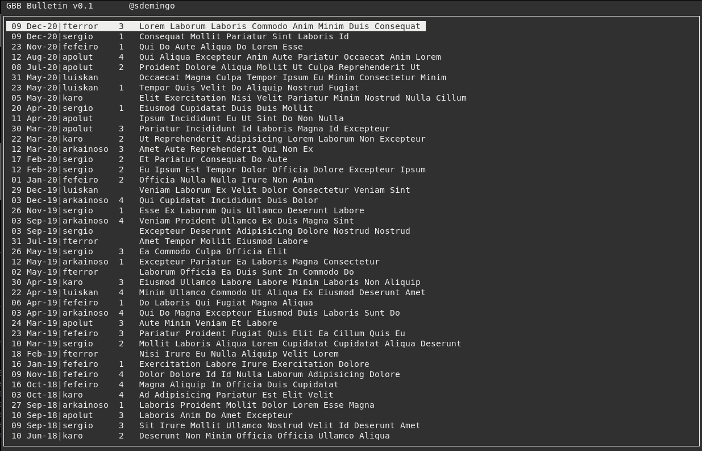

# GBB

A simple bulletin board writed in Go for the  terminal to run in a shared *nix server. It has a simple board with threads or conversations sorted by the last message date. It hasn't a users database and it uses the system common users. For admin tasks you must be logged as root (or sudo). 

The keys to use it are:

- `a`: Add a new thread or new message
- `d`: Delete a thread or a message. Only for admin or for the author 
- `e`: Edit a message. Only for admin or for the author 
- `f`: Fix a thread in the header of the board. Only for the admin
- `c`: Close a thread. Only for the admin
- `↑↓`: With arrows keys you can navegate into threads or the replies
- `AvPg/RePg`: To navigate inside the pages of a reply, If it is too long to show it in a screen
- `?`: Show the help
- `ESC`: Return to the previous panel or quit the application

All the help messages are in spanish but if you want to use `gbb` in your server and you want change them, ask me.

## Build

To compile `gbb` you must be installed Go17 or newest. 